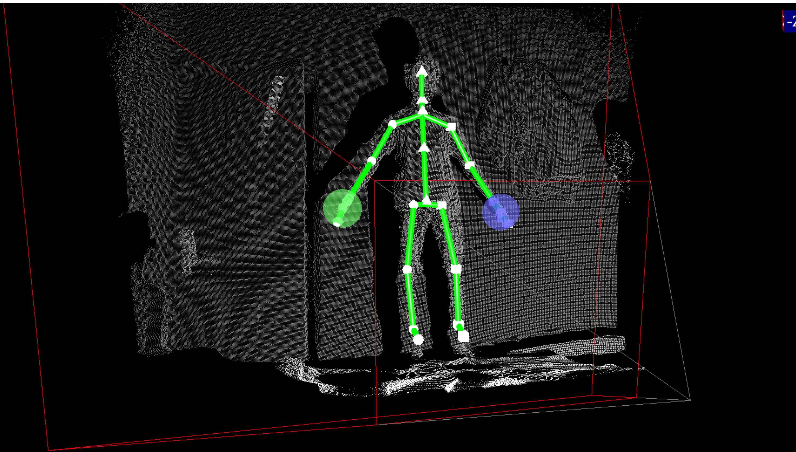
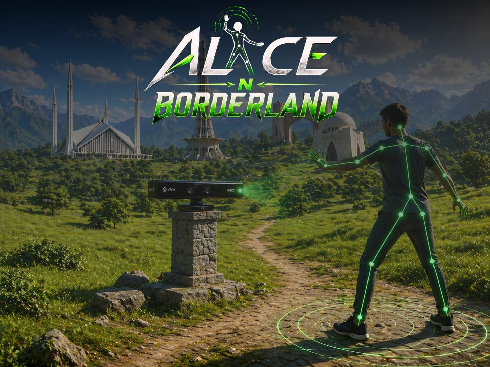
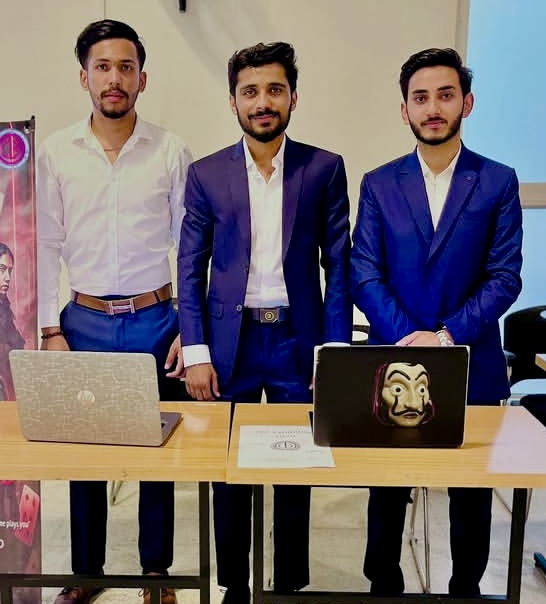

# Alice-In-Borderland

An educational rehabilitation game developed using Microsoft Kinect and Unity3D for real-time body tracking and gesture-based interaction.

The project combines healthcare rehabilitation with immersive gameplay to create a controller-free therapy experience using Kinect body tracking technology.

---

# Table of Contents

1. [Project Overview](#project-overview)
2. [Features](#features)
3. [Technologies Used](#technologies-used)
4. [Requirements](#requirements)
5. [Installation & Setup](#installation--setup)
6. [How to Run](#how-to-run)
7. [Gameplay Video](#gameplay-video)
8. [Project Screenshots](#project-screenshots)
9. [Kinect Integration](#kinect-integration)
10. [Team Members](#team-members)
11. [Future Improvements](#future-improvements)
12. [Repository](#repository)
13. [License](#license)

---

# Project Overview

Alice-In-Borderland is a Kinect-based rehabilitation game designed to improve physical movement, coordination, and patient engagement through interactive gameplay.

The system uses Microsoft Kinect v2 sensor technology to:

- Track body joints
- Detect movement and gestures
- Control gameplay without controllers
- Monitor rehabilitation exercises in real-time

The game environment provides immersive scenes and interactive activities for therapy and exercise training.

---

# Features

- Real-time body tracking
- Full-body motion detection
- Gesture-controlled gameplay
- Controller-free interaction
- Interactive rehabilitation exercises
- Multiple gameplay environments
- Lock/unlock level system
- Unity 3D immersive environment
- Kinect skeleton tracking
- Real-time player movement mapping

---

# Technologies Used

- Unity 3D
- Microsoft Kinect SDK v2
- Kinect v2 Unity Plugin
- C#
- Visual Studio
- Blender
- GitHub

---

# Requirements

Install the following software before running the project:

- Unity 3D
- Microsoft Kinect SDK v2
- Kinect v2 Unity Plugin
- Visual Studio Community
- Windows 10/11
- Kinect v2 Sensor + Adapter

---

# Installation & Setup

## 1. Install Kinect SDK

Download and install Microsoft Kinect SDK v2.

## 2. Install Unity

Install Unity Hub and Unity Editor.

## 3. Clone Repository

```bash
git clone https://github.com/Talalhaider123/Alice-In-Borderland.git
```

## 4. Open Project

Open the project folder using Unity Hub.

## 5. Connect Kinect Sensor

Attach Kinect v2 sensor and ensure drivers are installed correctly.

---

# How to Run

1. Open the Unity Project
2. Load the Main Scene
3. Connect Kinect Device
4. Press Play in Unity
5. Start body tracking and gameplay

---

# Gameplay Video

Download and watch the gameplay video below:

[▶ Watch Gameplay Video](video/video.mp4)

---

# Project Screenshots

---

## Kinect 2D Tracking


---

## Kinect Full Body Detection


---

## Kinect 3D Tracking



---

## Level Lock System


---

## Gameplay Environment


---

## Mosque Environment


---

## Final Poster



---

# Kinect Integration

The project integrates Microsoft Kinect v2 for:

- Skeleton Tracking
- Joint Detection
- Gesture Recognition
- Player Movement Mapping
- Real-Time Motion Capture
- Rehabilitation Exercise Monitoring

The Kinect sensor enables a fully controller-free gaming experience for rehabilitation and therapy exercises.

---

# Team Members

- Final Year Project Team
- Talal Haider
- Rehan Ali
- Syed Hassan Mujtaba
---
## Team Presentation


# Future Improvements

- Multiplayer rehabilitation mode
- AI exercise recommendation system
- Online patient progress monitoring
- Voice command integration
- Additional therapy exercises
- Advanced gesture recognition
- VR compatibility support

---

# Repository

GitHub Repository:

```text
https://github.com/Talalhaider123/Alice-In-Borderland
```

---

# License

This project is developed for educational and academic purposes as part of a Final Year Project (FYP).
